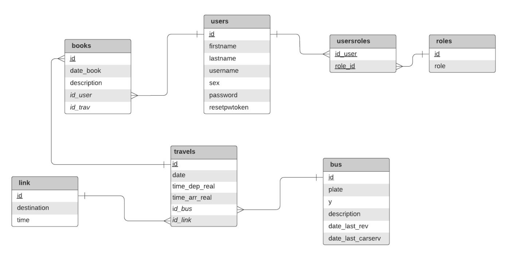
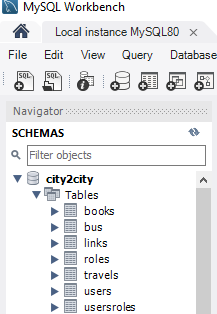
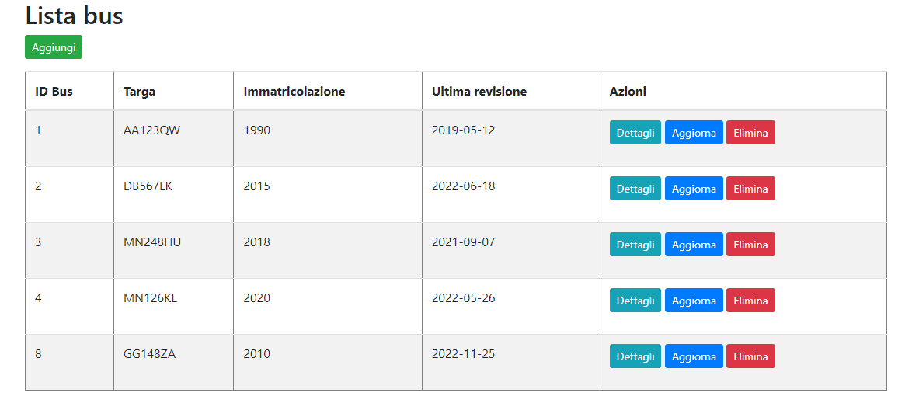
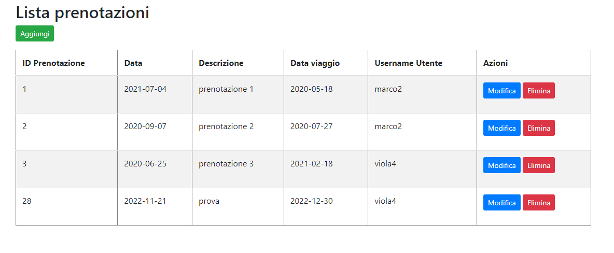
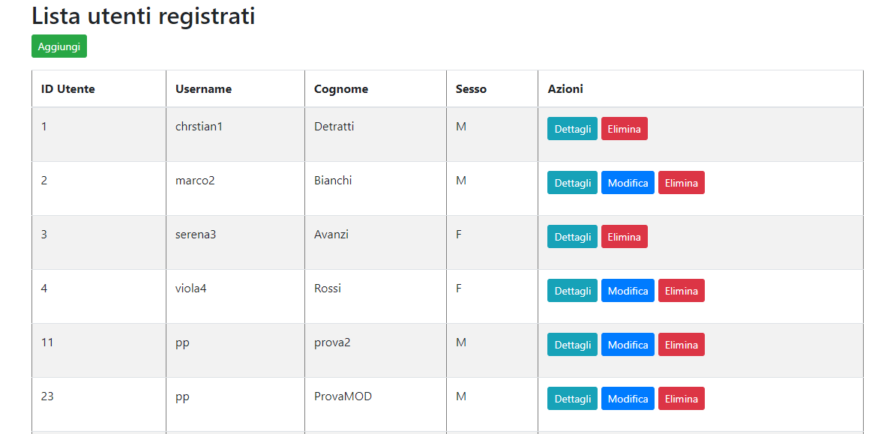
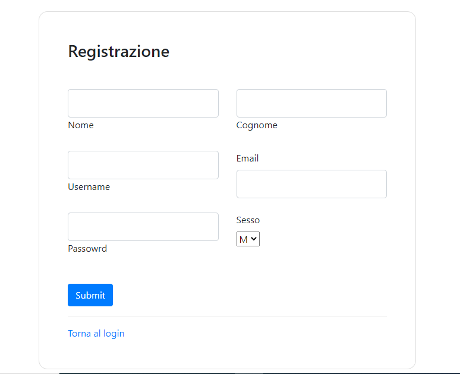

# Progetto Ingegneria del Software Avanzata a.a. 22/23
## Specifica dei requisiti ##
Il documento dei requisiti è consultabile al seguente link: 
https://drive.google.com/file/d/1ly2vg7QIeYEdFzdVKAFo5WFGQbxtog60/view?usp=sharing

## Introduzione ##
Il progetto consiste nella realizzazione di un'applicazione Web di un'agenzia che organizza viaggi con bus turistici. L'applicazione è stata pensata tenendo conto di due tipologie di utenti: utenti amministratori (admin) e gli ipotetici clienti dell'agenzia (user). Nello specifico sono state implementate le seguenti funzionalità:

- Form di login per accedere all'applicazione web.
- Form di registrazione nel caso in cui un nuovo utente voglia accedere all'applicazione.
- Procedura di recupero della password.
- Inserimento, modifica e cancellazione viaggi organizzati dall'agenzia. L'utente user può procedere solo alla visualizzazione dei viaggi in programma.
- Inserimento, modifica e cancellazione degli autobus dell'agenzia. L'utente user può procedere solo alla visualizzazione dei bus.
- Inserimento, modifica e cancellazione dei collegamenti disponibili. L'utente user può procedere solo alla visualizzazione dei collegamenti disponibili.
- Inserimento, modifica e cancellazione degli utenti registrati. Questa è una funzionalità prevista solo per l'admin.
- Compimento di una prenotazione. Gli utenti possono prenotare i viaggi che la compagnia offre; da specificare che l'admin può effettuare una prenotazione per conto di un qualsiasi utente user. E' possbile poi eliminare o modificare le prentazioni.
- Modifica del proprio profilo con annessa possibilità di cambiare la password scelta in fase di registrazione. Questa è una funzionalità relativa al solo utente user.

Da notare che le procedure di eliminazione sono eseguite sempre previa conferma dell'utente.

## Modello ER ##

## Requisiti ##
Affinchè il progetto funzioni è necessario creare un database di nome "city2city", ad esempio, all'interno del software MySQL Workbench, ed importare le tabelle già popolate di dati presenti in questa cartella di GitHub all'interno di "DB". Successivamente è necessario modificare il file application.properties con le proprie credenziali di accesso al database.
 
Soltanto poi sarà possibile avviare il progetto tramite IDE. Di seguito viene presentata la struttura del database "city2city" alla base del progetto.
  

## Struttura del Progetto ##
Il progetto è realizzato nel pieno rispetto del pattern Model-View-Controller (MVC) caratterizzato da un Model che fornisce i metodi utili per l'accesso al database, una View che si occupa della visualizzazione dei dati contenuti nel Model e dell'interazione con l'utente; infine vi è un Controller che riceve i comandi dell'utente andando a modificare gli altri componenti nel rispetto delle sue richieste.

L'intero sistema, inoltre, adotta un'approccio REST basato sui metodi:

- GET: per ricevere l'elenco di risorse disponibili (viaggi, collegamenti, user, bus e prenotazioni).
- POST: per l'inserimento e l'aggiornamento di risorse esistenti.
- DELETE: per la cancellazione di risorse non più necessarie.

## Diagramma UML ##
Di seguito è riportato il diagramma UML creato attraverso il tool gratuito LucidChart (https://www.lucidchart.com).
  

## Funzionamento del Progetto ##
Inizialmente viene avviato il framework Spring Boot che si fa carico della corretta cooperazione tra front-end e back-end e andrà a gestire l'intera applicazione. Nello specifico, in termini di front-end vengono gestiti tutti i comandi forniti dall'utente attraverso le pagine HTML ed il templates engine Thymeleaf. Diversamente, la parte di back-end, si occupa in primis di stabilire una connessione con il database attraverso il file "application.properties" per poi andare a comunicare con gli elementi del database (tabelle) mediante l'implementazione delle corrispettive Model classes. Gli elementi di congiunzione tra front-end e back-end sono dovuti ai diversi Controller che, data una pagina web all'utente, si occupano di gestire le operazione ad essa associata.
In aggiunta, viene utilizzato il framework Spring Security per la gestione di tutta la sicurezza implementata all'interno dell'applicazione web: la fase di autenticazione ed autorizzazione, login e tutto quello che riguarda la gestione password, criptate con il metodo Bycrpt.

## Strumenti utilizzati ##
Si è scelto di utilizzare i seguenti strumenti:

- [Maven](https://maven.apache.org/) - Per la gestione automatica di dipendenze software.
- [Visual Studio Code](https://code.visualstudio.com/) - Ambiente di sviluppo flessibile e ben supportato.
- [MySQL Workbench](https://www.mysql.com/products/workbench/) - Per la gestione del database.
- [Spring Boot](https://spring.io/projects/spring-boot) - Framework per applicazioni Web basate su Java.
- [Spring Security](https://spring.io/projects/spring-security) - Framework specifico per la gestione della sicurezza.
- [Thymeleaf](https://www.thymeleaf.org/) - Template engine, realizza la parte View.
- [Junit 5](https://junit.org/junit5/docs/current/user-guide/) - Per eseguire test lato model.
- [Selenium](https://www.selenium.dev) - Per eseguire test sul patten MVC.
- [LucidChart](https://www.lucidchart.com) - Per la modellazione.

## Test ##
Il progetto è correlato da unit test ed integration test. I primi sono stati realizzati attraverso Junit5 e si occupano di effettuare test (basati su proprietà) automatizzati relativi a metodi GET definiti nelle classi del model. A questo scopo sono state definite una serie di classi contenute nel package "utils" che consentono di generare stringhe e numeri randomici. L'integration test invece è realizzato attraverso il framework Selenium: si occupa di simulare il comportamento dell'utente attraverso il browser web (Google Chrome) spostandosi tra le pagine web, inserendo dati e interrogando il database.

## Sviluppi futuri ##
- Definizione di nuovi test sia di unità che di integrazione.
- Utilizzo di CSS per rendere GUI più user-friendly.
- Gestione dei posti autobus.

## Schermate di esempio ##
#### Schermata visualizzazione bus ####

#### Schermata prenotazioni ####

#### Schermata utenti ####

#### Schermata registrazione ####

