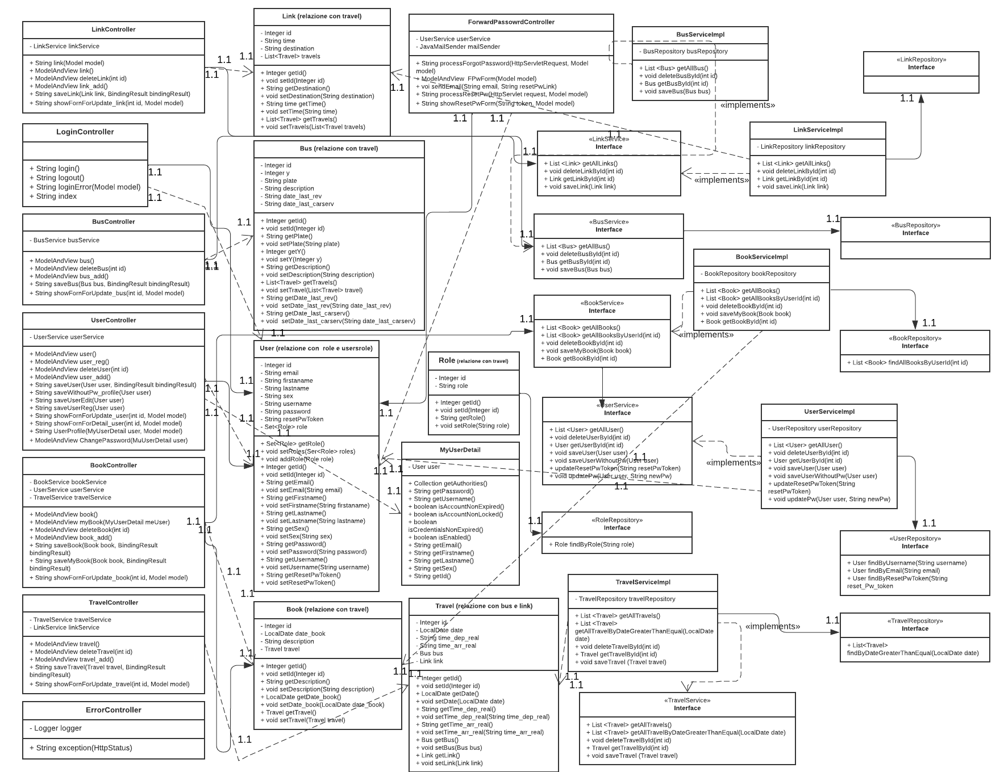

# Progetto Ingegneria del Software Avanzata a.a. 22/23
## Specifica dei requisiti ##
Il documento rei requisiti è consultabile al seguente link: 
https://docs.google.com/document/d/1sBp-W2q6lQir6Z1gPTQ8DwfvN2wVDgHe/edit?usp=sharing&ouid=105347893123203072224&rtpof=true&sd=true

## Introduzione ##
Il progetto consiste nella realizzazione di un'applicazione Web di un'agenzia che organizza viaggi con bus turistici. L'applicazione è stata pensata per due tipologie di utenti: utenti admin e gli ipotetici clienti dell'agenzia (user). Nello specifico sono state implementate le seguenti funzionalità:

- Form di login per accedere all'applicazione web.
- Form di registrazione nel caso in cui l'utente non si sia loggato in precedenza.
- Procedura di recupero della password.
- Inserimento, modifica e cancellazione viaggi organizzati dall'agenzia. L'utente user può procedere solo alla visualizzazione dei viaggi in programma.
- Inserimento, modifica e cancellazione degli autobus dell'agenzia. L'utente user può procedere solo alla visualizzazione dei bus.
- Inserimento, modifica e cancellazione degli utenti registrati. Questa è una funzionalità prevista solo pre l'admin.
- Inserimento, modifica e cancellazione degli collegamenti disponibili. L'utente user può procedere solo alla visualizzazione dei collegamenti disponibili.
- Effettuazione di una prenotazione. Gli utenti possono prenotare i viaggi che la compagnia offre; da specificare che l'admin può effettuare una prenotazione per conto di un utente user. E' possbile poi eliminare o modificare le prentazioni.
- Modifica del proprio profilo con annessa pobbilità di modifcare la password scelta in fase di registrazione. Questa è una funzionalità del solo utente user.

## Modello ER ##
INSERIRE MODELLO

## Requisiti ##
Affinchè il progetto funzioni è necessario creare un database di nome "city2city", ad esempio, all'interno del software MySQL Workbench, ed importare le tabelle già popolate di dati presenti in questa cartella di GitHub. Successivamente è necessario modificare il file application.properties con le proprie credenziali di accesso al database.
 
Solo sucessivamente è possibile avviare il progetto tramite IDE. Di seguito viene presentata la struttura del database "city2city" alla base del progetto.
  

## Struttura del Progetto ##
Il progetto è realizzato nel pieno rispetto del pattern Model-view-controller (MVC) caratterizzato da un model che fornisce i metodi utili per l'accesso all'applicazione, una view che si occupa della visualizzazione dei dati contenuti nel model e dell'interazione con l'utente, ed infine un controller che riceve i comandi dell'utente andando a modificare gli altri componenti.

L'intero sistema inoltre adotta un'approccio REST basato sui metodi:

GET: per ricevere l'elenco di risorse disponibili (viaggi, collegamenti, user, bus e prenotazioni).
PUT: per l'inserimento di nuove risorse.
POST: per l'aggiornamento di risorse esistenti.
DELETE: per la cancellazione di risorse non più necessarie.

## Diagramma UML ##
Di seguito vi è riportato il diagramma UML creato attraverso un tool gratuito trovato in rete, ovvero [LucidChart](https://www.lucidchart.com).
  

## Funzionamento del Progetto ##
All'avvio viene avviato il framework Spring Boot che si fa carico della corretta cooperazione tra front-end e back-end. Nello specifico in termini di front-end vengono gestiti tutti i comandi forniti dall'utente attraverso le pagine html. Ben più complessa invece risulta la parte di back-end che si occupa in primis di stabilire una connessione con il database attraverso un file "application.properties" per poi andare a comunicare con gli elementi del database (tabelle) mediante l'implementazione delle corrispettive classi. Per ogni classe vengono quindi definite delle variabili corrispondenti agli attributi della tabella contenuta nel database ed una serie di metodi che definiscono quali comportamenti sono applicabili alle classi. L'elemento di congiunzione tra front-end e back-end sono le diverse classi Controller che, data una pagina web all'utente, si occupano di gestire le operazione ad essa associata.
In agiuntaviene utilizzato Spring Security per la gestione della sicurezza implementata all'interno dell'applicazione web, ovvero durante la fase di autenticazione, login e tutto quello che riguarda la gestione password, criptate con il metodo Bycrpt.

## Strumenti utilizzati ##
Si è scelto di utilizzare i seguenti strumenti:

- Maven - Per la gestione automatica di dipendenze software.
- Visual Studio Code - Ambiente di sviluppo flessibile e ben supportato.
- MySQL Workbench - Per la gestione del database.
- Spring Boot - Framework per applicazioni Web basate su Java
- Spring Security - Tool di Spring Boot specifico per la gestione della sicurezza
- Thymeleaf - Motore di template, realizza la parte View di un Model-view-controller
- Junit 5 - Per eseguire test lato model
- Selenium - Per eseguire test sul patten MVC

## Test ##
Il progetto è correlato da unit test ed integration test. I primi sono stati realizzati attraverso Junit5 e si occupano di effettuare test (basati su proprietà) automatizzati relativi a metodi GET definiti nella classi del model. A questo scopo sono state definite una serie di classi contenute nel package "utils" che consentano di generare stringhe e numeri randomici. L'integration test invece è realizzato attraverso il framework Selenium: si occupa di simulare il comportamento dell'utente attraverso il browser web (Google Chrome) spostandosi tra le pagine web, inserendo dati e interrogando il database.
